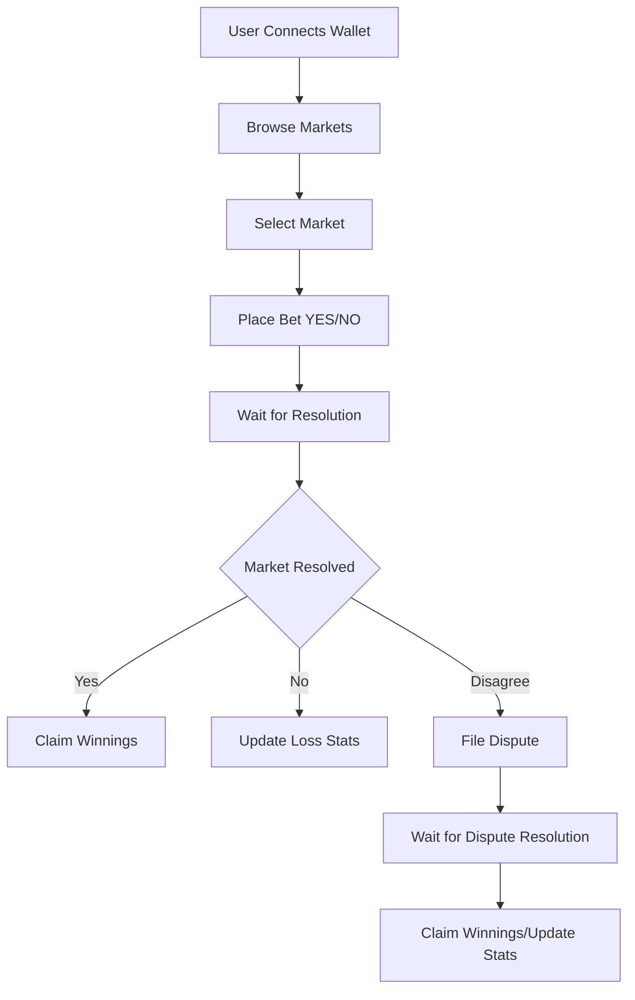
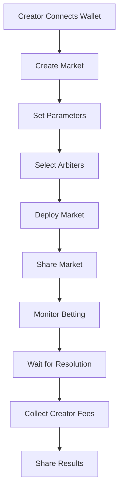
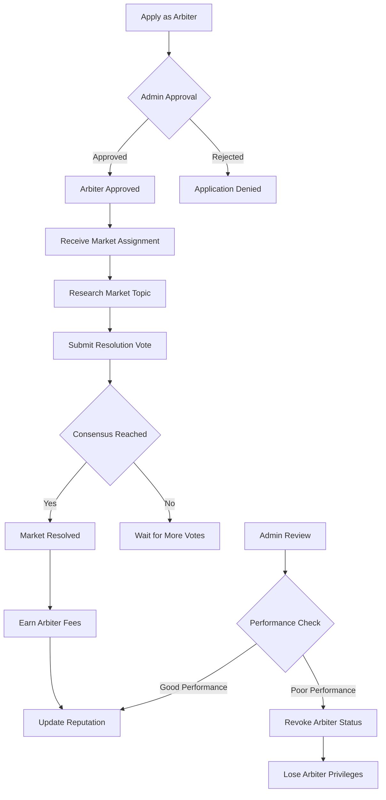

# Pythia - Decentralized Prediction Markets on Sui

[](https://github.com/Sui-Romanian-Hackathon/pythia/actions/workflows/build_and_lint.yaml)

Pythia is a decentralized prediction market platform built on the Sui blockchain. It empowers users to create, participate in, and resolve markets on real-world events, leveraging the high scalability and low latency of the Sui network.

## Motivation

Pythia addresses the need for reliable, decentralized prediction markets on Sui by implementing a sophisticated oracle system with multi-signature arbiters and built-in dispute resolution. The platform ensures fair outcomes through economic incentives, reputation tracking, and transparent governance mechanisms.

## Features

- **Prediction Markets**: Seamlessly create and trade on markets for any future event.
- **Unified Wallet Access**: Log in effortlessly using Google accounts (zkLogin) or connect standard Sui wallets.
- **Decentralized & Secure**: Fully on-chain logic ensures transparency and security for all market data and funds.
- **Community Driven**: Built for the community, with tools for decentralized moderation and dispute resolution.
- **Multi-Sig Arbiters**: Secure resolution system with configurable thresholds and performance tracking
- **User Profiles**: Auto-created profiles tracking betting history, wins, reputation, and earnings
- **Dispute System**: Bonded dispute mechanism allowing users to challenge unfair resolutions
- **Protocol Economics**: Configurable fee structure for creators, arbiters, and protocol treasury
- **Trust Scores**: Reputation system for arbiters based on resolution accuracy
- **Creator Incentives**: Fee sharing for market creators to encourage quality markets
- **Market Sharing**: Creators can share markets via QR codes and social links
- **Unified Claim System**: Single interface for winners to claim payouts and losers to update stats
- **Storage Optimization**: Automatic cleanup of resolved data to minimize gas costs
- **Comprehensive Testing**: Full test suite covering market lifecycle, disputes, and edge cases
- **Suibase Integration**: Seamless local development and deployment workflows

## Prerequisites

Before you begin, install the following:

- [Suibase](https://suibase.io/how-to/install.html)
- [Node (>= 20)](https://nodejs.org/en/download/)
- [pnpm (>= 9)](https://pnpm.io/installation)

## Quick Start

Get Pythia running in minutes:

```bash
# Clone and install
git clone https://github.com/Sui-Romanian-Hackathon/pythia.git
cd pythia
pnpm install

# Start local network and deploy contract
pnpm localnet:start
pnpm localnet:deploy

# Run the frontend
pnpm start
```

Visit [localhost:5173](http://localhost:5173/) to access the application locally.

**Live Demo**: [pythia-frontend-zeta.vercel.app](https://pythia-frontend-zeta.vercel.app/)

## Installation

### Clone the Repository

1. Clone the repository:

```bash
git clone https://github.com/Sui-Romanian-Hackathon/pythia.git
cd pythia
```

2. Install dependencies:

```bash
pnpm install
```

## Development Workflow

### Local Development

1. **Start local Sui network**:

   ```bash
   pnpm localnet:start
   ```

2. **Deploy contract**:

   ```bash
   pnpm localnet:deploy
   ```

3. **Run frontend**:
   ```bash
   pnpm start
   ```

### Network Deployment

Deploy to different networks:

```bash
# Testnet
pnpm testnet:deploy

# Mainnet
pnpm mainnet:deploy
```

## Usage

#### 1. Run the local Sui network:

```bash
pnpm localnet:start
```

Local Sui Explorer will be available on [localhost:9001](http://localhost:9001/)

#### 2. Deploy the Pythia contract to the local network:

```bash
pnpm localnet:deploy
```

_This command deploys the Pythia Move package with all prediction market functionality._

#### 3. Switch to the local network in your browser wallet settings.

#### 4. Fund your localnet account/address:

You have a few options here:

a) Use the Faucet button integrated into your wallet (e.g. Sui Wallet).

b) Copy the localnet address from your wallet and run the following in your console:

```bash
pnpm localnet:faucet 0xYOURADDRESS
```

c) Run the app and use the Faucet button in the footer.

#### 5. Run the application:

```bash
pnpm start
```

The frontend will be available on [localhost:5173](http://localhost:5173/)

## Testing

### Backend (Move Contract)

```bash
pnpm test
```

The test suite covers:

- Market lifecycle (creation, betting, resolution, claiming)
- Dispute mechanism (filing, resolution, bond handling)
- Access control (admin functions, arbiter authorization)
- Consensus logic (multi-arbiter voting, thresholds)
- Economic safety (bet amounts, fee distribution)
- Edge cases (deadlines, invalid parameters, state transitions)

### Frontend Testing

```bash
pnpm frontend:test
```

## Documentation & Support

- [Backend Documentation](./packages/backend/README.md) - Move contract details and API
- [Frontend Documentation](./packages/frontend/README.md) - React app and components
- [Available Commands](#usage) - Development and deployment commands
- [GitHub Issues](https://github.com/Sui-Romanian-Hackathon/pythia/issues) - Report bugs and request features

## Architecture

### Backend (Move Package)

Located in `packages/backend/move/pythia/`, containing:

- Core prediction market logic
- Multi-signature arbiter system
- User profile management
- Dispute resolution mechanism
- Protocol configuration

### Frontend (React App)

Located in `packages/frontend/`, providing:

- Market creation interface
- Betting interface
- Portfolio and profile management
- Dispute filing system
- Arbiter dashboard

## User Flows

### Bettor Workflow 



### Creator Workflow



### Arbiter Workflow



## Useful Links

- [Suibase Documentation](https://suibase.io/intro.html)
- [Move Language Guide](https://move-book.com/)
- [Sui Move Best Practices](https://docs.sui.io/concepts/sui-move-concepts/conventions)
- [Sui Developer Portal](https://docs.sui.io/)
- [Awesome Sui](https://github.com/sui-foundation/awesome-sui)
- [Sui Discord](https://discord.com/sui)

## Key Components

### Core Features

- **Prediction Markets**: Create YES/NO markets with customizable parameters
- **Multi-Sig Resolution**: Configurable arbiter thresholds for secure outcomes
- **Dispute System**: Bonded challenges to ensure fair resolutions
- **User Profiles**: Track betting history, reputation, and earnings
- **Protocol Fees**: Sustainable economic model with fee distribution

### Technical Highlights

- **Storage Optimization**: Automatic cleanup to minimize gas costs
- **Comprehensive Testing**: Full coverage of all market scenarios
- **Type Safety**: Strongly typed Move contract with formal verification
- **Event-Driven**: Rich event system for frontend integration

## License & Copyright

Copyright (c) 2024 Pythia Contributors

Code is licensed under [MIT](https://github.com/Sui-Romanian-Hackathon/pythia/blob/main/LICENSE)

## Roadmap

- [ ] **Q1 2026**: Enhanced UI/UX with real-time market updates
- [ ] **Q2 2026**: Mobile app development (React Native) with push notifications
- [ ] **Q3 2026**: Advanced market types (multi-outcome, conditional)
- [ ] **Q4 2026**: Cross-chain oracle integration
- [ ] **Future**: DAO governance for protocol parameters

## Performance & Security

### Gas Optimization

- Storage rebates through automatic data cleanup
- Efficient batch operations for multiple bets
- Optimized dispute resolution flow

### Security Measures

- Multi-signature arbiter validation
- Bonded dispute system to prevent spam
- Access control for admin functions
- Comprehensive test coverage including edge cases

## Contributing

We welcome contributions! Please see our [Contributing Guide](CONTRIBUTING.md) for details.

**Development Setup:**

1. Fork the repository
2. Create a feature branch: `git checkout -b feature/amazing-feature`
3. Make your changes and add tests
4. Run tests: `pnpm test`
5. Submit a pull request

**Areas for Contribution:**

- Frontend UI/UX improvements
- Additional test coverage
- Documentation enhancements
- Performance optimizations
- New market types or features
