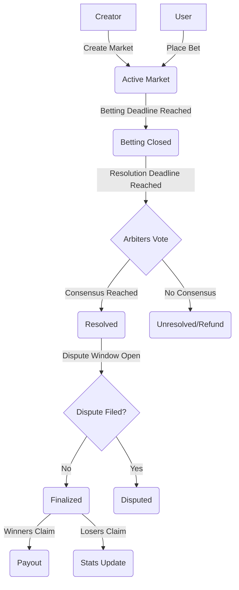
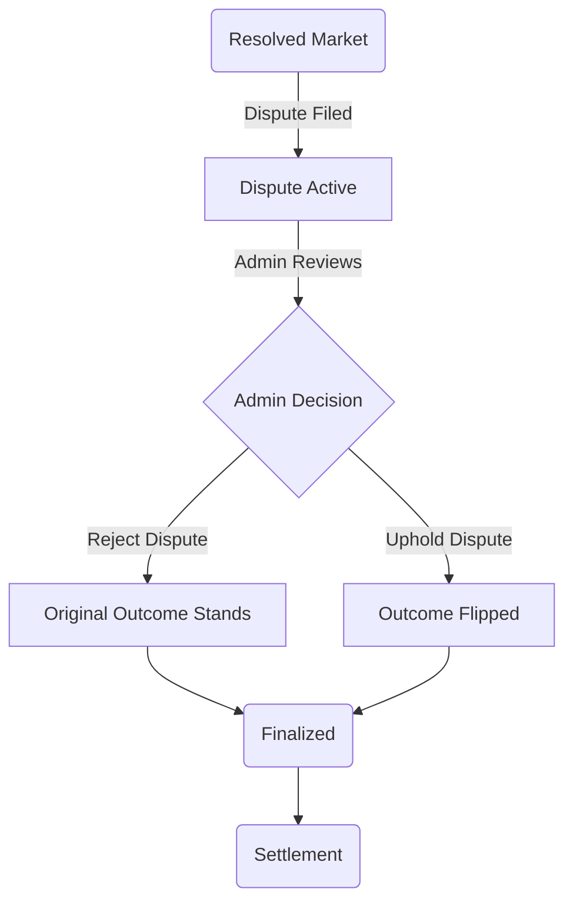

# Pythia Prediction Market - Backend

> [!NOTE]
> This is the backend Move package for the Pythia Prediction Market.
> Please find the root project [README](../../README.md).

Pythia is a decentralized prediction market on Sui, featuring multi-sig arbiters, trust scores, user profiles, a dispute system, protocol fees, and creator incentives.

## Features

- **User Profiles**: Auto-created profiles tracking bets, wins, and reputation.
- **Trusted Arbiters**: Multi-sig resolution system with performance tracking.
- **Dispute Mechanism**: Bonded dispute system to ensure fair outcomes.
- **Protocol Incentives**: Configurable fees for creators, arbiters, and the protocol.

## Development

### Prerequisites

- [Sui CLI](https://docs.sui.io/guides/developer/getting-started/sui-install)
- [Node.js](https://nodejs.org/) & [pnpm](https://pnpm.io/)

### Build & Test

Use the scripts defined in `package.json`:

```bash
# Build the Move package
pnpm run build

# Run Move tests
pnpm run test

# Deploy to testnet
pnpm run testnet:deploy

# CLI deploy
sui client publish --gas-budget 1000000000 ./move/pythia
```

#### Test Coverage

The test suite (`pythia_tests.move`) covers the following scenarios:

- **Market Lifecycle**: Creation, betting (YES/NO), resolution, and claiming winnings.
- **Dispute Mechanism**: Filing disputes, admin resolution (uphold/reject), and bond handling.
- **Access Control**: Verifies admin-only functions, arbiter authorization, and prevents unauthorized actions (e.g., arbiters betting).
- **Consensus Logic**: Tests multi-arbiter voting and threshold enforcement.
- **Economic Safety**: Validates minimum bet amounts, fee distribution, and losing position burning.
- **Edge Cases**: Checks deadline enforcement, invalid market parameters, and state transitions.

## Technical Architecture

### Data Structures

<details>
<summary>Click to view Core Structs</summary>

```move
const CURRENT_VERSION: u64 = 1;

/// One-Time Witness
public struct PYTHIA has drop {}

public struct UserProfile has key {
    id: UID,
    version: u64,
    address: address,
    total_bets: u64,
    total_wins: u64,
    total_amount_bet: u64,
    total_amount_won: u64,
    total_amount_lost: u64,
    markets_created: u64,
    creator_earnings: u64,
    disputes_filed: u64,
    disputes_won: u64,
    last_active_timestamp: u64,
}

public struct ArbiterProfile has drop, store {
    version: u64,
    address: address,
    total_resolutions: u64,
    correct_resolutions: u64,
    approved: bool,
    last_active_timestamp: u64,
    total_earnings: u64,
}

public struct ProtocolConfig has key {
    id: UID,
    version: u64,
    protocol_fee_bps: u64,
    creator_fee_bps: u64,
    arbiter_fee_bps: u64,
    min_bet_amount: u64,
    dispute_bond: u64,
    dispute_period: u64,
    dispute_threshold: u64,
    max_disputes_per_user: u64,
    treasury: address,
    admin: address,
    arbiters: VecMap<address, ArbiterProfile>,
}

public struct Dispute has store {
    market_id: ID,
    supporters: VecSet<address>,
    total_bond: Balance<SUI>,
    reason: String,
    proposed_outcome: bool,
    created_at: u64,
    resolved: bool,
    upheld: bool,
}

public struct Market has key {
    id: UID,
    version: u64,
    description: String,
    betting_end_time: u64,
    resolution_deadline: u64,
    total_yes_amount: u64,
    total_no_amount: u64,
    pot_yes: Balance<SUI>,
    pot_no: Balance<SUI>,
    outcome: Option<bool>,
    creator: address,
    creator_fee_bps: u64,
    arbiters: vector<address>,
    arbiter_threshold: u64,
    arbiter_votes: VecMap<address, bool>,
    resolved: bool,
    dispute_end_time: u64,
    disputed: bool,
    finalized: bool,
    dispute: Option<Dispute>,
}

public struct Position has key {
    id: UID,
    version: u64,
    market_id: ID,
    owner: address,
    is_yes: bool,
    amount: u64,
    claimed: bool,
}
```

</details>

### Events

<details>
<summary>Click to view Event Definitions</summary>

```move
public struct EventBetPlaced has copy, drop {
    market_id: ID,
    bettor: address,
    is_yes: bool,
    amount: u64,
    new_yes_total: u64,
    new_no_total: u64,
    timestamp: u64,
}

public struct EventMarketCreated has copy, drop {
    market_id: ID,
    creator: address,
    description: String,
    betting_end_time: u64,
    timestamp: u64,
}

public struct EventMarketResolved has copy, drop {
    market_id: ID,
    outcome: bool,
    total_pool: u64,
    timestamp: u64,
}

public struct EventWinningsClaimed has copy, drop {
    market_id: ID,
    user: address,
    amount: u64,
    timestamp: u64,
}

public struct EventDisputeFiled has copy, drop {
    market_id: ID,
    dispute_id: ID,
    challenger: address,
    timestamp: u64,
}
```

</details>

## Mechanics

### Core Functions

| Function                  | Description                                                                                   |
| :------------------------ | :-------------------------------------------------------------------------------------------- |
| `create_profile`          | Creates a new `UserProfile` for the caller.                                                   |
| `create_market`           | Creates a new prediction market with specified parameters and arbiters.                       |
| `place_bet`               | Places a bet on a market, automatically creates a `UserProfile` if one does not exist.        |
| `submit_resolution`       | Arbiter submits their resolution vote for a market.                                           |
| `file_dispute`            | Files a dispute on a resolved market by a losing bettor, requiring a bond and position proof. |
| `resolve_dispute`         | Admin resolves a dispute, either upholding or rejecting it.                                   |
| `finalize_market`         | Finalizes a market after dispute period, settling fees and preparing for claims.              |
| `claim`                   | Unified claim function for winners and losers, updating profiles accordingly.                 |
| `acknowledge_dispute_win` | User acknowledges a won dispute to update their profile stats.                                |
| `approve_arbiter`         | Admin approves an arbiter for resolution duties.                                              |

### Optimizations

| Optimization            | Benefit                                                                     |
| :---------------------- | :-------------------------------------------------------------------------- |
| **Auto-create profile** | Reduces friction; users don't need a separate "sign up" transaction.        |
| **Prune votes**         | Clears `arbiter_votes` VecMap after finalization to refund storage rebates. |
| **Unified claim**       | Simplifies frontend logic by having one entry point for settlement.         |

### State Updates

| Action                    | Profile Updates Triggered                    |
| :------------------------ | :------------------------------------------- |
| `place_bet`               | `total_bets++`, `total_amount_bet += amount` |
| `claim` (win)             | `total_wins++`, `total_amount_won += payout` |
| `claim` (loss)            | `total_amount_lost += amount`                |
| `file_dispute`            | `disputes_filed++`                           |
| `acknowledge_dispute_win` | `disputes_won++`                             |

## Usage Flows

### 1. Market Creator

- **Create Market**: Defines the question, betting deadline, resolution deadline, and appoints arbiters.
  - _Function_: `pythia::create_market`

### 2. Bettor (User)

- **Place Bet**: Users wager SUI on YES or NO.
  - _Note_: If it's the user's first interaction, a `UserProfile` is automatically created.
  - _Function_: `pythia::place_bet`
- **Claim**: After resolution, winners claim payouts. Losers call this to update their loss stats on their profile.
  - _Function_: `pythia::claim`

### 3. Arbiter

- **Approve**: Arbiters must first be approved by the protocol admin.
  - _Function_: `pythia::approve_arbiter`
- **Vote**: After the betting window closes, arbiters submit their resolution (YES/NO).
  - _Function_: `pythia::submit_resolution`
- **Consensus**: Once the `arbiter_threshold` is met, the market is resolved.

### 4. Disputer (Losing Bettor)

- **File Dispute**: If the arbiters decide incorrectly, a user with a losing position can file a dispute within the dispute window by posting a bond and providing their position as proof.
  - _Function_: `pythia::file_dispute`

### 5. Admin

- **Resolve Dispute**: Review and resolve disputes by upholding or rejecting them.
  - _Function_: `pythia::resolve_dispute`
- **Finalize Market**: After the dispute period, finalize the market to settle fees.
  - _Function_: `pythia::finalize_market`

## Visual Workflows

### Market Lifecycle



### Dispute Resolution


