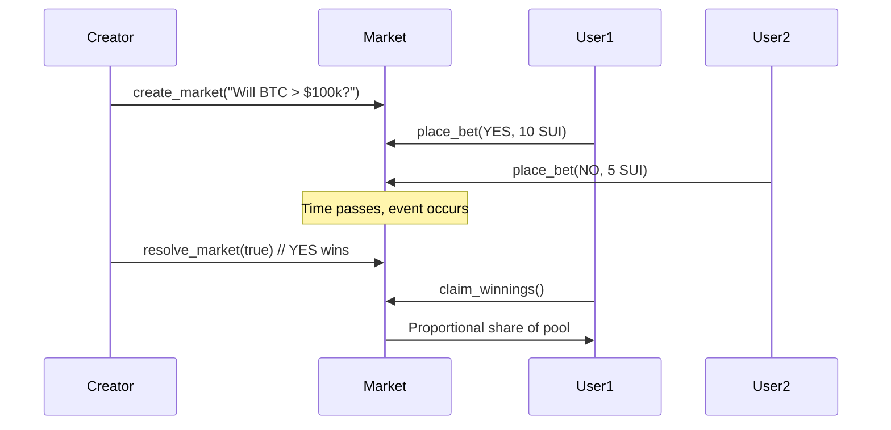

# Prediction Market Smart Contract Implementation

A decentralized prediction market system on Sui blockchain where users can create markets for binary outcomes, place bets using SUI tokens, and claim rewards when markets resolve.

## Proposed Changes

### Prediction Market Module

#### [NEW] [prediction_market](file:///home/work/Projects/Sui-Developer-Program/pythia/packages/backend/move/prediction_market/)

Create a new Move package for the prediction market with the following architecture:

**Core Data Structures:**

```move
/// Represents a prediction market for a binary outcome
public struct Market has key {
    id: UID,
    description: String,           // Market question/description
    end_time: u64,                 // Deadline for placing bets
    resolution_time: u64,          // When the market can be resolved
    total_yes_amount: u64,         // Total SUI bet on YES
    total_no_amount: u64,          // Total SUI bet on NO
    outcome: Option<bool>,         // None = unresolved, Some(true) = YES won
    creator: address,              // Market creator
    resolved: bool,                // Whether market has been resolved
}

/// Position/bet placed by a user
public struct Position has key {
    id: UID,
    market_id: ID,                 // Reference to the market
    owner: address,                // Position owner
    is_yes: bool,                  // true = YES bet, false = NO bet
    amount: u64,                   // Amount in MIST (smallest SUI unit)
    claimed: bool,                 // Whether rewards have been claimed
}
```

**Key Functions:**

| Function         | Description                                      | Access |
| ---------------- | ------------------------------------------------ | ------ |
| `create_market`  | Create a new prediction market                   | Public |
| `place_bet`      | Place a YES or NO bet with SUI                   | Public |
| `resolve_market` | Resolve market with final outcome (creator only) | Entry  |
| `claim_winnings` | Claim winnings for winning positions             | Public |
| `get_odds`       | Calculate current odds for YES/NO                | View   |

**Events:**

- `MarketCreated` - Emitted when a new market is created
- `BetPlaced` - Emitted when a bet is placed
- `MarketResolved` - Emitted when a market is resolved
- `WinningsClaimed` - Emitted when winnings are claimed

**Files to Create:**

| File                                 | Purpose                    |
| ------------------------------------ | -------------------------- |
| `Move.toml`                          | Package configuration      |
| `sources/prediction_market.move`     | Main module with all logic |
| `tests/prediction_market_tests.move` | Comprehensive test suite   |

---

### Example Usage Flow



---

## Verification Plan

### Automated Tests

The Move test suite will verify:

```bash
# Run all prediction market tests
cd packages/backend/move/prediction_market && sui move test
```

**Test Cases:**

1. **Market Creation** - Verify market is created with correct parameters
2. **Bet Placement** - Verify YES/NO bets update totals correctly
3. **Multiple Bets** - Verify multiple users can bet on same market
4. **Market Resolution** - Verify only creator can resolve after deadline
5. **Winnings Calculation** - Verify proportional distribution of pool
6. **Invalid Operations** - Verify betting after deadline fails, double-claim fails

### Manual Verification

After tests pass, deploy to localnet:

```bash
# Start localnet
pnpm localnet:start

# Deploy prediction market
cd packages/backend/move/prediction_market && sui move build && sui client publish --gas-budget 100000000
```

Then manually verify:

1. Create a market via CLI or frontend
2. Place bets from different accounts
3. Resolve the market
4. Claim winnings and verify correct amounts
