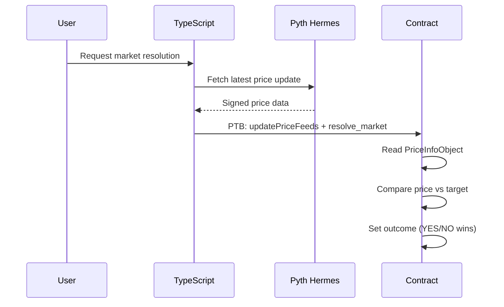

# Sui Prediction Market with Pyth Oracle Integration

Build a decentralized prediction market on Sui where users bet on whether crypto prices will be above or below a target price by a specific time. The market uses **Pyth Network** oracle to fetch real-time crypto prices for automated resolution.

## User Review Required

> [!IMPORTANT] > **Oracle Choice**: Using Pyth Network as the oracle provider. Pyth has production-ready Sui integration with extensive price feed coverage (BTC, ETH, SUI, etc.).

> [!WARNING] > **Price Feed Updates Happen Off-Chain**: Pyth uses a "pull" model—price updates must be submitted via TypeScript SDK before calling contract functions. The Move contract cannot fetch prices autonomously; a TypeScript backend or frontend must push fresh prices during resolution.

---

## Proposed Changes

### Prediction Market Move Package

Create a complete Move package at `packages/backend/move/prediction_market/`.

#### [NEW] [Move.toml](file:///home/work/Projects/Sui-Developer-Program/pythia/packages/backend/move/prediction_market/Move.toml)

Package configuration with Pyth and Wormhole dependencies for testnet:

```toml
[package]
name = "prediction_market"
edition = "2024"

[dependencies.Pyth]
git = "https://github.com/pyth-network/pyth-crosschain.git"
subdir = "target_chains/sui/contracts"
rev = "sui-contract-testnet"

[dependencies.Wormhole]
git = "https://github.com/wormhole-foundation/wormhole.git"
subdir = "sui/wormhole"
rev = "sui/testnet"

[dependencies.Sui]
git = "https://github.com/MystenLabs/sui.git"
subdir = "crates/sui-framework/packages/sui-framework"
rev = "041c5f2bae2fe52079e44b70514333532d69f4e6"

[addresses]
prediction_market = "0x0"
```

---

#### [NEW] [prediction_market.move](file:///home/work/Projects/Sui-Developer-Program/pythia/packages/backend/move/prediction_market/sources/prediction_market.move)

**Core Data Structures:**

```move
/// Price-based prediction market
public struct PriceMarket has key, store {
    id: UID,
    description: String,
    asset_name: String,              // e.g., "BTC", "ETH", "SUI"
    price_feed_id: vector<u8>,       // Pyth price feed ID (32 bytes)
    target_price: u64,               // Target price in scaled format
    target_price_decimals: u8,       // Decimals for target_price
    is_above: bool,                  // true = bet price will be ABOVE target
    end_time: u64,                   // Deadline for placing bets (ms)
    total_yes_amount: u64,           // Total SUI bet on YES
    total_no_amount: u64,            // Total SUI bet on NO
    yes_balance: Balance<SUI>,       // Actual SUI for YES bets
    no_balance: Balance<SUI>,        // Actual SUI for NO bets
    outcome: Option<bool>,           // None = unresolved
    resolved: bool,
    creator: address,
}

/// Position NFT representing a user's bet
public struct Position has key, store {
    id: UID,
    market_id: ID,
    owner: address,
    is_yes: bool,
    amount: u64,
    claimed: bool,
}
```

**Key Functions:**

| Function              | Description                                                      |
| --------------------- | ---------------------------------------------------------------- |
| `create_price_market` | Create market betting on price above/below target                |
| `place_bet`           | Place YES or NO bet with SUI coins                               |
| `resolve_market`      | Resolve using Pyth oracle price (anyone can call after deadline) |
| `claim_winnings`      | Claim proportional share of losing pool                          |
| `get_market_info`     | View function for market details                                 |

**Oracle Integration Flow:**



---

#### [NEW] [prediction_market_tests.move](file:///home/work/Projects/Sui-Developer-Program/pythia/packages/backend/move/prediction_market/tests/prediction_market_tests.move)

Test suite covering:

- Market creation with valid parameters
- Bet placement (YES and NO)
- Multiple user scenarios
- Winnings calculation and claiming
- Edge cases (betting after deadline, double claiming)

> [!NOTE]
> Oracle tests will use mock price data since Pyth contracts aren't available in test mode. Resolution tests will verify the logic with simulated price feeds.

---

## Verification Plan

### Automated Tests

```bash
# Build the prediction market package
cd packages/backend/move/prediction_market && sui move build

# Run all tests
cd packages/backend/move/prediction_market && sui move test
```

**Expected Test Scenarios:**

1. ✅ Market creation stores correct parameters
2. ✅ YES/NO bets update totals correctly
3. ✅ Position NFTs are created with correct data
4. ✅ Winners receive proportional share of loser pool
5. ✅ Cannot bet after deadline
6. ✅ Cannot claim before resolution
7. ✅ Cannot double-claim winnings

### Manual Verification

After tests pass, deploy to testnet:

```bash
cd packages/backend/move/prediction_market
sui client publish --gas-budget 200000000
```

Then use the Sui CLI or frontend to:

1. Create a price market (e.g., "Will BTC > $100,000?")
2. Place bets from different accounts
3. Wait for deadline, push Pyth price update, resolve
4. Verify winners receive correct payouts
